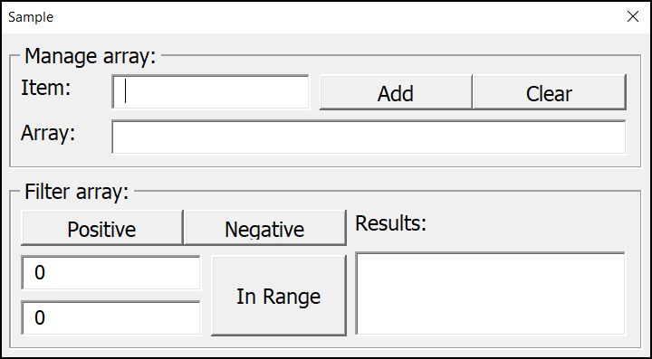

# Description
arrays - shows how to handle arrays.

# Options
# Array management
- `Add` - adds item to array
- `Clear` - clears array

# Array filtering
- `Positive` - extracts only positive numbers from array
- `Negative` - extracts only negative numbers from array
- `In Range` - extracts only numbers in specified range from array
